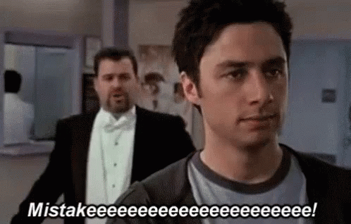

# P'error
Sometimes we get tired, sometimes we still code at 2 am, but with this library you can easily fall asleep, and if Python catches some exception while executing your your code, you will totally wake up.

# Copyrights ©2019 by XII, Anna Ganieva and her friend from musical college.

